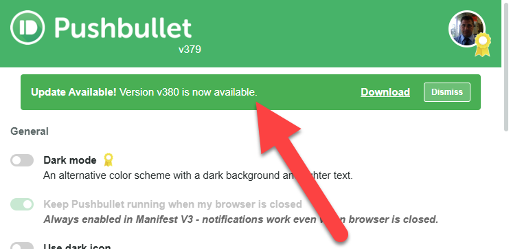

# Pushbullet Chrome Extension UNOFFICIAL (Manifest V3)

A community-maintained version of the Pushbullet Chrome extension updated to work with Manifest V3.  This extension REQUIRES you have an account already with Pushbullet.com and I am NOT affiliated with them and you can sign up when you open the extension.

**REPORT ERRORS AND I WILL GET THEM FIXED.  PLEASE PROVIDE ALL CONSOLE ERROR CODE WHEN YOU REPORT.**

IF YOU LIKE THIS EXTENSION I HAVE BUILT A LOT MORE.  JUST SAY THANKS, GIVE IT A STAR AND I WILL START TO COMPILE MY DIRECTORY OF VIBE-CODED CHROME EXTENSIONS AND SHARE THEM!  I HAVE A BUNCH - THANKS.

---

## 🎉 LATEST UPDATE - v379 (December 2025)

### Major Manifest V3 Fixes and Improvements
- ✅ **Settings now persist** after browser restart (dark mode, auto-open, etc.)
- ✅ **Notification sounds working** in Manifest V3 (Offscreen Documents API)
- ✅ **Background notifications** work when browser is closed (Chrome Alarms API with 1-minute intervals)
- ✅ **SMS notifications** reliable with 90-second fetch window
- ✅ **Chat windows and SMS** now load properly (page-v3.js compatibility)
- ✅ **Automatic update checker** - Get notified in settings when new version available

---

## 🔔 How You'll Get Updates

**IMPORTANT:** This is a community fix and **CANNOT be uploaded to the Chrome Web Store** (it's a modified/unofficial version).

### Automatic Update Notifications
- The extension now includes an **automatic GitHub release checker**
- Every 24 hours, it checks for new releases from this repository
- When a new version is available, you'll see a **green notification banner** in the extension settings
- Click the download link to get the latest version



**This is the ONLY way you'll be notified of updates** - please check your settings page occasionally or watch this repository for releases!

### How to Update When Notified
1. Download the new version zip file from the release page
2. Extract the zip file contents
3. Copy all extracted files and **overwrite** your existing extension folder (the one you're using with "Load unpacked")
4. Go to `chrome://extensions/`
5. Click the **refresh icon** on the Pushbullet extension card
6. Your extension is now updated - settings and login are preserved!

---

## ⚠️ CRITICAL: MMS REQUIRES ENCRYPTION TO BE DISABLED ⚠️

**IMPORTANT CAVEAT:** MMS (multimedia messages with images) **WILL NOT WORK** if end-to-end encryption is enabled in settings.

### **Why MMS Doesn't Work With Encryption:**
- The Pushbullet server automatically **deletes MMS messages** when encryption is active
- This is a **server-side limitation**, not a bug in the extension
- Regular SMS text messages work fine with encryption
- Only MMS (image/multimedia messages) are affected

### **To Use MMS:**
1. Open Pushbullet Settings
2. **Disable End-to-End Encryption**
3. Send MMS images normally
4. ⚠️ Re-enabling encryption will break MMS again

**You must choose:** MMS functionality (encryption OFF) OR End-to-end encryption (no MMS)

---

## Background

The original Pushbullet Chrome extension uses Manifest V2, which is no longer supported in newer versions of Chrome. This repository contains a modified version that works with Manifest V3, allowing you to continue using Pushbullet in modern Chrome browsers.

## Features

- 📱 Send pushes between devices
- 💬 SMS messaging from your computer
- 📎 File sharing
- 🔔 Notification mirroring
- 🔒 End-to-end encryption support
- 🔔 **Notification sounds** work in Manifest V3 (Offscreen Documents API)
- ⏰ **Background notifications** when browser closed (Chrome Alarms API)
- 🔄 **Automatic update checker** - get notified of new releases
- 💾 **Persistent settings** - dark mode, auto-open, and other settings save properly
- 📋 **Release notes** visible in settings page
- 💬 **Support & feedback section** with issue reporting
- ✨ All original Pushbullet features preserved

## Installation

### Recommended: Download Latest Release

1. Go to the [Releases page](https://github.com/genetrader/pushbullet-fix/releases)
2. Download the latest `pushbullet-v###-final.zip` file
3. Extract the zip file to a permanent location on your computer
4. Open Chrome and navigate to `chrome://extensions/`
5. Enable "Developer mode" in the top right corner
6. Click "Load unpacked"
7. Select the extracted folder
8. Sign in to your Pushbullet account when prompted

### Alternative: Clone from Source

```bash
# Clone the repository
git clone https://github.com/genetrader/pushbullet-fix.git
cd pushbullet-fix

# No build process required - load directly in Chrome
```

**Important:** Keep the extension folder in a permanent location. If you delete it, the extension will stop working.

## Differences from Original

### Technical Changes for Manifest V3:
- Converted background scripts to service workers
- Replaced `chrome.browserAction` with `chrome.action` API
- Updated `chrome.extension` APIs to modern equivalents
- Added polyfills for `XMLHttpRequest` and `localStorage` in service workers
- Modified context menu implementation to use `onClicked` events
- Implemented message passing between UI pages and service worker

### Files Added:
- `background.js` - Service worker entry point
- `sw-polyfills.js` - Compatibility layer for V3
- `page-v3.js` - Updated page script for UI communication
- `context-menu-v3.js` - Updated context menu implementation
- `message-handler.js` - Message passing handler
- `offscreen-manager.js` - Manages offscreen document for audio playback (v379)
- `offscreen.html` / `offscreen.js` - Audio playback in MV3 service workers (v379)
- `service-worker-keepalive.js` - Chrome Alarms API keepalive system (v379)
- `update-checker.js` - GitHub release monitoring and notifications (v379)

## Known Issues

### ⚠️ MMS + Encryption Incompatibility (CRITICAL)
- **MMS messages WILL NOT WORK if end-to-end encryption is enabled**
- The server deletes MMS messages when encryption is active
- You must disable encryption in Settings to use MMS
- This is a server-side limitation, not an extension bug
- Regular SMS works fine with encryption - only MMS is affected

### Other Notes
- Initial load may take a moment as the service worker initializes
- Old MMS images from Backblaze may show 404 errors (handled gracefully)
- Background notifications have up to 1-minute delay when browser is closed (Chrome Alarms API limitation)

### Fixed in v379
- ✅ Settings now persist after browser restart
- ✅ Notification sounds work properly
- ✅ Background notifications work when browser closed
- ✅ SMS notifications appear reliably
- ✅ Chat windows and SMS load correctly

## Contributing

Contributions are welcome! Please feel free to submit pull requests or open issues for bugs and feature requests.

## Disclaimer

This is an unofficial, community-maintained version of the Pushbullet Chrome extension. It is not affiliated with or endorsed by Pushbullet. All trademarks and copyrights belong to their respective owners.

## Original Source

The original extension can be found on the [Chrome Web Store](https://chrome.google.com/webstore/detail/pushbullet/chlffgpmiacpedhhbkiomidkjlcfhogd).

## License

This project maintains the same license as the original Pushbullet extension. See LICENSE file for details.

---

## 📬 Note to Pushbullet Product Developer

I've tried to reach out to you several times and would happily hand this code over to you or work with you to get this loaded for your product on Chrome. I am not looking to make money - just to help fix a tool I love and use and would help you too, if you want it.

Feel free to contact me at genetrader@gmail.com if you'd like to collaborate or take over this work.
